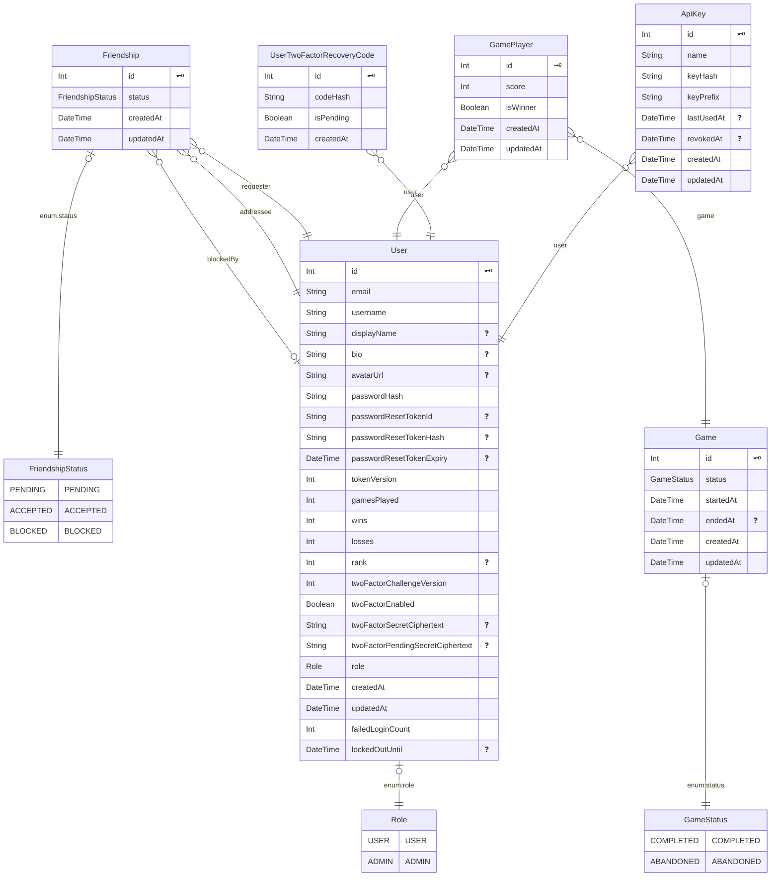

```mermaid
erDiagram

        Role {
            USER USER
ADMIN ADMIN
        }


        GameStatus {
            COMPLETED COMPLETED
ABANDONED ABANDONED
        }


        FriendshipStatus {
            PENDING PENDING
ACCEPTED ACCEPTED
BLOCKED BLOCKED
        }

  "User" {
    Int id "🗝️"
    String email
    String username
    String displayName "❓"
    String bio "❓"
    String avatarUrl "❓"
    String passwordHash
    String passwordResetTokenId "❓"
    String passwordResetTokenHash "❓"
    DateTime passwordResetTokenExpiry "❓"
    Int tokenVersion
    Int gamesPlayed
    Int wins
    Int losses
    Int rank "❓"
    Int twoFactorChallengeVersion
    Boolean twoFactorEnabled
    String twoFactorSecretCiphertext "❓"
    String twoFactorPendingSecretCiphertext "❓"
    Role role
    DateTime createdAt
    DateTime updatedAt
    Int failedLoginCount
    DateTime lockedOutUntil "❓"
    }


  "ApiKey" {
    Int id "🗝️"
    String name
    String keyHash
    String keyPrefix
    DateTime lastUsedAt "❓"
    DateTime revokedAt "❓"
    DateTime createdAt
    DateTime updatedAt
    }


  "UserTwoFactorRecoveryCode" {
    Int id "🗝️"
    String codeHash
    Boolean isPending
    DateTime createdAt
    }


  "Game" {
    Int id "🗝️"
    GameStatus status
    DateTime startedAt
    DateTime endedAt "❓"
    DateTime createdAt
    DateTime updatedAt
    }


  "GamePlayer" {
    Int id "🗝️"
    Int score
    Boolean isWinner
    DateTime createdAt
    DateTime updatedAt
    }


  "Friendship" {
    Int id "🗝️"
    FriendshipStatus status
    DateTime createdAt
    DateTime updatedAt
    }

    "User" |o--|| "Role" : "enum:role"
    "ApiKey" }o--|| "User" : "user"
    "UserTwoFactorRecoveryCode" }o--|| "User" : "user"
    "Game" |o--|| "GameStatus" : "enum:status"
    "GamePlayer" }o--|| "Game" : "game"
    "GamePlayer" }o--|| "User" : "user"
    "Friendship" |o--|| "FriendshipStatus" : "enum:status"
    "Friendship" }o--|| "User" : "requester"
    "Friendship" }o--|| "User" : "addressee"
    "Friendship" }o--|o "User" : "blockedBy"
```
