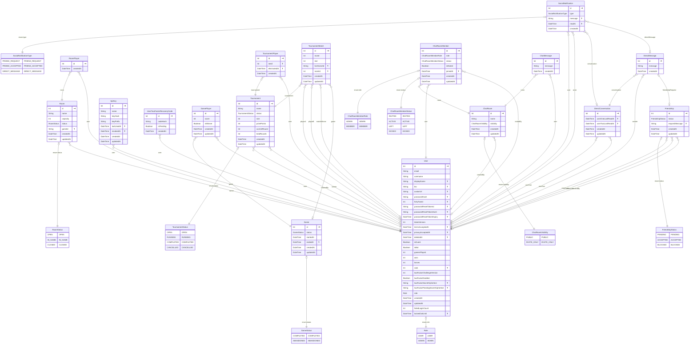

```mermaid
erDiagram

        Role {
            USER USER
ADMIN ADMIN
        }


        GameStatus {
            COMPLETED COMPLETED
ABANDONED ABANDONED
        }


        FriendshipStatus {
            PENDING PENDING
ACCEPTED ACCEPTED
BLOCKED BLOCKED
        }


        SocialNotificationType {
            FRIEND_REQUEST FRIEND_REQUEST
FRIEND_ACCEPTED FRIEND_ACCEPTED
DIRECT_MESSAGE DIRECT_MESSAGE
        }


        RoomStatus {
            OPEN OPEN
IN_GAME IN_GAME
CLOSED CLOSED
        }


        ChatRoomVisibility {
            PUBLIC PUBLIC
INVITE_ONLY INVITE_ONLY
        }


        ChatRoomMemberRole {
            ADMIN ADMIN
MEMBER MEMBER
        }


        ChatRoomMemberStatus {
            INVITED INVITED
ACTIVE ACTIVE
LEFT LEFT
KICKED KICKED
        }


        TournamentStatus {
            OPEN OPEN
RUNNING RUNNING
COMPLETED COMPLETED
CANCELLED CANCELLED
        }

  "User" {
    Int id "🗝️"
    String email
    String username
    String displayName "❓"
    String bio "❓"
    String avatarUrl "❓"
    String passwordHash "❓"
    Int fortyTwoId "❓"
    String passwordResetTokenId "❓"
    String passwordResetTokenHash "❓"
    DateTime passwordResetTokenExpiry "❓"
    Int tokenVersion
    DateTime termsAcceptedAt "❓"
    DateTime privacyAcceptedAt "❓"
    DateTime deletedAt "❓"
    Boolean isGuest
    Boolean isBot
    Int gamesPlayed
    Int wins
    Int losses
    Int rank "❓"
    Int twoFactorChallengeVersion
    Boolean twoFactorEnabled
    String twoFactorSecretCiphertext "❓"
    String twoFactorPendingSecretCiphertext "❓"
    Role role
    DateTime createdAt
    DateTime updatedAt
    Int failedLoginCount
    DateTime lockedOutUntil "❓"
    }


  "ApiKey" {
    Int id "🗝️"
    String name
    String keyHash
    String keyPrefix
    DateTime lastUsedAt "❓"
    DateTime revokedAt "❓"
    DateTime createdAt
    DateTime updatedAt
    }


  "UserTwoFactorRecoveryCode" {
    Int id "🗝️"
    String codeHash
    Boolean isPending
    DateTime createdAt
    }


  "Game" {
    Int id "🗝️"
    GameStatus status
    DateTime startedAt
    DateTime endedAt "❓"
    DateTime createdAt
    DateTime updatedAt
    }


  "GamePlayer" {
    Int id "🗝️"
    Int score
    Boolean isWinner
    DateTime createdAt
    DateTime updatedAt
    }


  "Room" {
    Int id "🗝️"
    String name
    Int capacity
    RoomStatus status
    String gameId "❓"
    DateTime createdAt
    DateTime updatedAt
    }


  "RoomPlayer" {
    Int id "🗝️"
    DateTime createdAt
    }


  "Tournament" {
    Int id "🗝️"
    String name
    TournamentStatus status
    Int size
    Int prizePoints
    Int currentRound
    Int totalRounds
    DateTime createdAt
    DateTime updatedAt
    }


  "TournamentPlayer" {
    Int id "🗝️"
    Int seed "❓"
    DateTime eliminatedAt "❓"
    DateTime createdAt
    }


  "TournamentMatch" {
    Int id "🗝️"
    Int round
    Int slot
    String liveGameId "❓"
    Int roomId "❓"
    DateTime createdAt
    DateTime updatedAt
    }


  "Friendship" {
    Int id "🗝️"
    FriendshipStatus status
    String requestMessage "❓"
    DateTime createdAt
    DateTime updatedAt
    }


  "ChatRoom" {
    Int id "🗝️"
    String name
    ChatRoomVisibility visibility
    DateTime createdAt
    DateTime updatedAt
    }


  "ChatRoomMember" {
    Int id "🗝️"
    ChatRoomMemberRole role
    ChatRoomMemberStatus status
    Boolean isMuted
    DateTime joinedAt "❓"
    DateTime createdAt
    DateTime updatedAt
    }


  "ChatMessage" {
    Int id "🗝️"
    String message
    DateTime createdAt
    }


  "DirectConversation" {
    Int id "🗝️"
    DateTime userOneLastReadAt "❓"
    DateTime userTwoLastReadAt "❓"
    DateTime createdAt
    DateTime updatedAt
    }


  "DirectMessage" {
    Int id "🗝️"
    String message
    DateTime createdAt
    }


  "SocialNotification" {
    Int id "🗝️"
    SocialNotificationType type
    String message "❓"
    DateTime readAt "❓"
    DateTime createdAt
    }

    "User" |o--|| "Role" : "enum:role"
    "ApiKey" }o--|| "User" : "user"
    "UserTwoFactorRecoveryCode" }o--|| "User" : "user"
    "Game" |o--|| "GameStatus" : "enum:status"
    "GamePlayer" }o--|| "Game" : "game"
    "GamePlayer" }o--|| "User" : "user"
    "Room" |o--|| "RoomStatus" : "enum:status"
    "Room" }o--|| "User" : "owner"
    "RoomPlayer" }o--|| "Room" : "room"
    "RoomPlayer" }o--|| "User" : "user"
    "Tournament" |o--|| "TournamentStatus" : "enum:status"
    "Tournament" }o--|| "User" : "createdBy"
    "Tournament" }o--|o "User" : "winner"
    "TournamentPlayer" }o--|| "Tournament" : "tournament"
    "TournamentPlayer" }o--|| "User" : "user"
    "TournamentMatch" }o--|| "Tournament" : "tournament"
    "TournamentMatch" }o--|o "User" : "playerA"
    "TournamentMatch" }o--|o "User" : "playerB"
    "TournamentMatch" }o--|o "User" : "matchWinner"
    "TournamentMatch" }o--|o "Game" : "game"
    "Friendship" |o--|| "FriendshipStatus" : "enum:status"
    "Friendship" }o--|| "User" : "requester"
    "Friendship" }o--|| "User" : "addressee"
    "Friendship" }o--|o "User" : "blockedBy"
    "ChatRoom" |o--|| "ChatRoomVisibility" : "enum:visibility"
    "ChatRoom" }o--|| "User" : "createdBy"
    "ChatRoomMember" |o--|| "ChatRoomMemberRole" : "enum:role"
    "ChatRoomMember" |o--|| "ChatRoomMemberStatus" : "enum:status"
    "ChatRoomMember" }o--|| "ChatRoom" : "room"
    "ChatRoomMember" }o--|| "User" : "user"
    "ChatRoomMember" }o--|o "User" : "invitedBy"
    "ChatMessage" }o--|| "ChatRoom" : "room"
    "ChatMessage" }o--|| "User" : "user"
    "DirectConversation" }o--|| "User" : "userOne"
    "DirectConversation" }o--|| "User" : "userTwo"
    "DirectMessage" }o--|| "DirectConversation" : "conversation"
    "DirectMessage" }o--|| "User" : "sender"
    "DirectMessage" |o--|o "Friendship" : "friendshipRequest"
    "SocialNotification" |o--|| "SocialNotificationType" : "enum:type"
    "SocialNotification" }o--|| "User" : "user"
    "SocialNotification" }o--|o "User" : "actor"
    "SocialNotification" }o--|o "DirectConversation" : "conversation"
    "SocialNotification" }o--|o "DirectMessage" : "directMessage"
```
