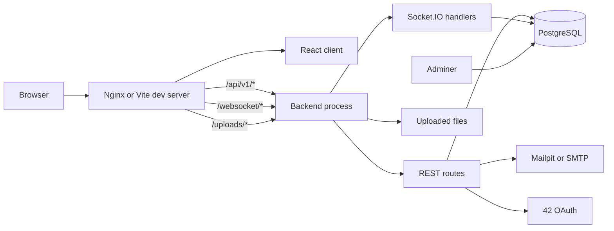
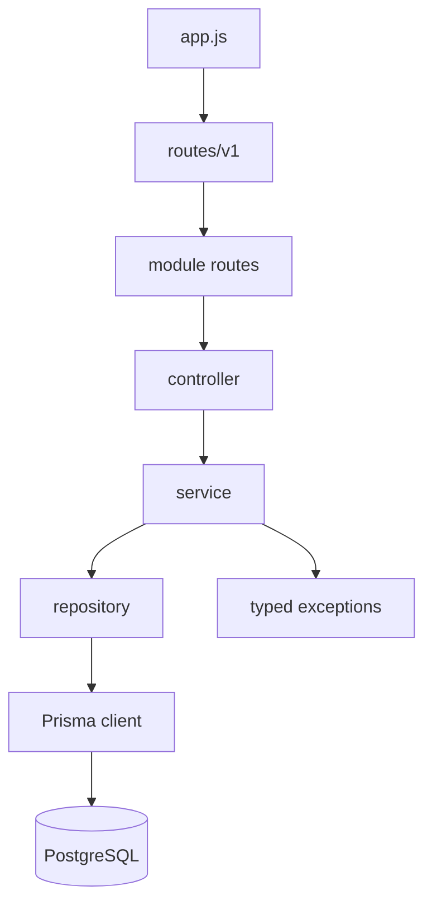
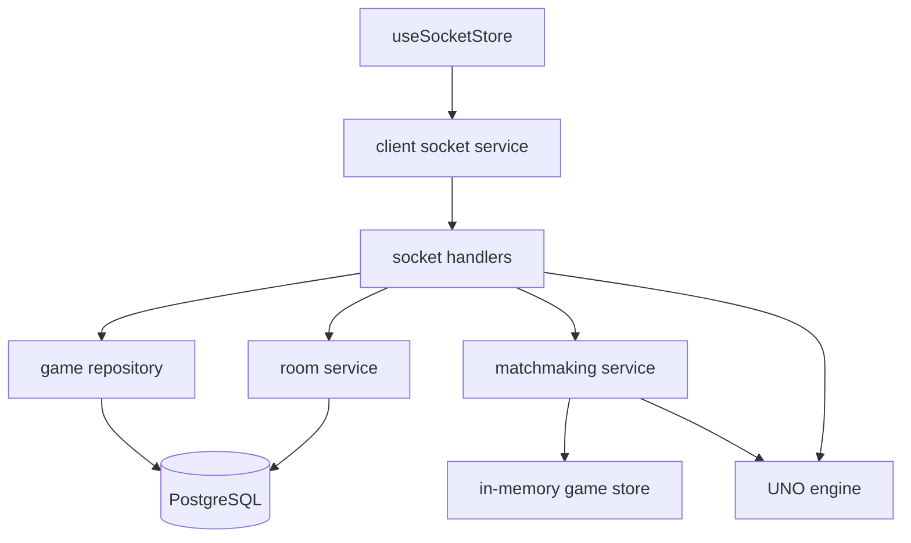
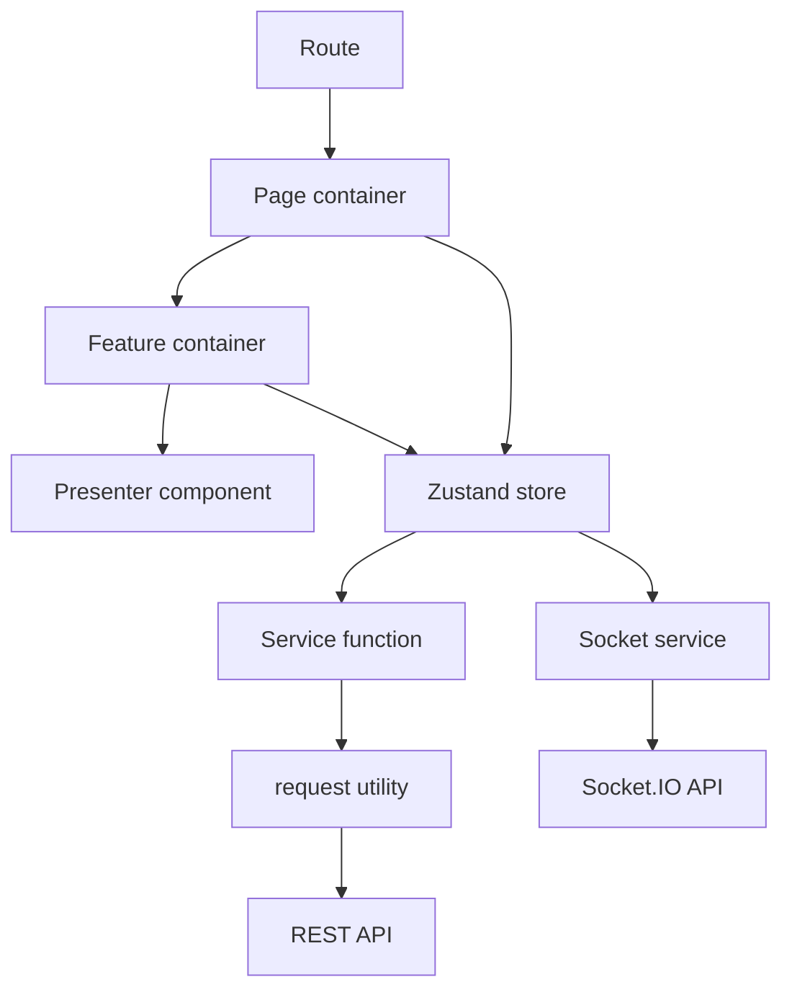

# System Architecture

This document gives a quick technical map of Trackscendence for new
contributors. It complements the database ERD in `docs/ERD.md` and the
frontend-specific rules in `docs/frontend-coding-standards.md`.

## System topology

In development, Vite serves the React app and proxies `/api`, `/websocket`, and
`/uploads` to the server container. In the production-style compose stack, Nginx
serves the built React app and performs the same routing. The backend owns both
REST and WebSocket behavior, with PostgreSQL as the durable store.

## Backend dependency layers

Controllers only validate request shape and translate service results into HTTP
responses. Services own business rules, security checks, and exception throwing.
Repositories own Prisma queries and must use explicit `select` objects when
returning user data.

## Realtime game layers

Open rooms are durable records in PostgreSQL. Running game engines live in the
in-memory game store while a match is active, then completed or abandoned results
are flushed to PostgreSQL.

## Frontend dependency layers

Pages and feature containers may read stores. Presenters receive props and render
markup. Components do not call services directly; the normal path is component to
store action to service to `request`.

## Ownership boundaries

| Area            | Owns                                  | Does not own                              |
| --------------- | ------------------------------------- | ----------------------------------------- |
| React page      | Routing, store reads, high-level flow | Raw API calls                             |
| Store           | Client state and async actions        | DOM rendering                             |
| Service         | Endpoint shape                        | UI state                                  |
| Controller      | HTTP request and response mapping     | Business rules                            |
| Service layer   | Business rules and validation         | Raw SQL/Prisma query details              |
| Repository      | Database queries                      | Password checks, JWTs, UI payload shaping |
| Socket handlers | WebSocket event orchestration         | Engine rules                              |
| Game engine     | UNO turn rules                        | Persistence or sockets                    |
