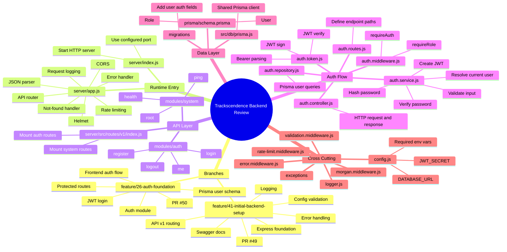

# Backend Issue Review Plan

Last checked: 2026-05-20

This document is a review plan for backend-related GitHub issues and the backend/auth branches that are currently open. The goal is to understand the code before implementing new backend work, avoid overlapping with assigned teammates, and build a clear mental model of the server architecture.

## Current Branches And PRs

| PR | Branch | Base | Assignee/Author | Purpose | Review Priority |
| --- | --- | --- | --- | --- | --- |
| [#49](https://github.com/Trackscendence/trackscendence/pull/49) | `feature/41-initial-backend-setup` | `dev` | `adshz` | Backend foundation: app structure, API v1 routes, config, logging, middleware, errors, Swagger | 1 |
| [#50](https://github.com/Trackscendence/trackscendence/pull/50) | `feature/26-auth-foundation` | `dev` | `adshz` | Auth foundation: Prisma user fields, register, login, JWT, `/me`, logout, frontend auth flow | 2 |
| [#36](https://github.com/Trackscendence/trackscendence/pull/36) | `dev` | `main` | `sroderic` | Dev containerization/port fixes | Background context |

Important dependency:

`feature/26-auth-foundation` builds on top of `feature/41-initial-backend-setup`, so review PR #49 before PR #50.

## Collision Risk

Avoid working directly on these without coordinating first:

| Issue | Assignee | Reason |
| --- | --- | --- |
| [#26](https://github.com/Trackscendence/trackscendence/issues/26) User Authentication Foundation | `adshz` | Has active branch/PR #50 |
| [#38](https://github.com/Trackscendence/trackscendence/issues/38) Confirm backend project structure | `adshz` | Related to backend foundation |
| [#39](https://github.com/Trackscendence/trackscendence/issues/39) Design API Authentication & Authorisation | `adshz` | Related to auth foundation |
| [#40](https://github.com/Trackscendence/trackscendence/issues/40) Backend Project Structure Proposal | `adshz` | Related to backend foundation |
| [#41](https://github.com/Trackscendence/trackscendence/issues/41) Backend Project Initial Setup | `adshz` | Has active branch/PR #49 |
| [#42](https://github.com/Trackscendence/trackscendence/issues/42) Validate environment config | `adshz` | Related to PR #49 |
| [#43](https://github.com/Trackscendence/trackscendence/issues/43) Structured logging and request logging | `adshz` | Related to PR #49 |
| [#44](https://github.com/Trackscendence/trackscendence/issues/44) Baseline Express middleware | `adshz` | Related to PR #49 |
| [#45](https://github.com/Trackscendence/trackscendence/issues/45) API v1 router and health routes | `adshz` | Related to PR #49 |
| [#46](https://github.com/Trackscendence/trackscendence/issues/46) Centralized error handling | `adshz` | Related to PR #49 |
| [#47](https://github.com/Trackscendence/trackscendence/issues/47) Swagger OpenAPI documentation | `adshz` | Related to PR #49 |
| [#51](https://github.com/Trackscendence/trackscendence/issues/51) Auth validation and API contract | `mooreApps22` | Assigned and has a comment saying they are working on it |

Unassigned backend or backend-adjacent issues are safer candidates after the foundation review, but they may still depend on PR #49 and PR #50.

## Backend Issue Groups

### Foundation

| Issue | Assignee | Notes |
| --- | --- | --- |
| [#38](https://github.com/Trackscendence/trackscendence/issues/38) | `adshz` | Backend architecture decision and structure discussion |
| [#40](https://github.com/Trackscendence/trackscendence/issues/40) | `adshz` | Structure proposal |
| [#41](https://github.com/Trackscendence/trackscendence/issues/41) | `adshz` | Initial backend setup |
| [#42](https://github.com/Trackscendence/trackscendence/issues/42) | `adshz` | Environment config validation |
| [#43](https://github.com/Trackscendence/trackscendence/issues/43) | `adshz` | Logging |
| [#44](https://github.com/Trackscendence/trackscendence/issues/44) | `adshz` | Express middleware |
| [#45](https://github.com/Trackscendence/trackscendence/issues/45) | `adshz` | API v1 router and health routes |
| [#46](https://github.com/Trackscendence/trackscendence/issues/46) | `adshz` | Centralized errors |
| [#47](https://github.com/Trackscendence/trackscendence/issues/47) | `adshz` | Swagger docs |

### Auth And Authorization

| Issue | Assignee | Notes |
| --- | --- | --- |
| [#26](https://github.com/Trackscendence/trackscendence/issues/26) | `adshz` | Main auth foundation |
| [#39](https://github.com/Trackscendence/trackscendence/issues/39) | `adshz` | Token/auth flow design |
| [#51](https://github.com/Trackscendence/trackscendence/issues/51) | `mooreApps22` | Validation and API contract |
| [#52](https://github.com/Trackscendence/trackscendence/issues/52) | Unassigned | Password and session security |
| [#53](https://github.com/Trackscendence/trackscendence/issues/53) | Unassigned | Failed login protection and freeze |
| [#54](https://github.com/Trackscendence/trackscendence/issues/54) | Unassigned | Signup hardening |
| [#55](https://github.com/Trackscendence/trackscendence/issues/55) | Unassigned | Login hardening |
| [#56](https://github.com/Trackscendence/trackscendence/issues/56) | Unassigned | Standard user management planning |
| [#57](https://github.com/Trackscendence/trackscendence/issues/57) | Unassigned | OAuth, likely optional/later |
| [#58](https://github.com/Trackscendence/trackscendence/issues/58) | Unassigned | Two-factor authentication |
| [#59](https://github.com/Trackscendence/trackscendence/issues/59) | Unassigned | Roles and access control |
| [#60](https://github.com/Trackscendence/trackscendence/issues/60) | Unassigned | Privacy, HTTPS, account data |

### Backend Feature Modules

| Issue | Assignee | Notes |
| --- | --- | --- |
| [#27](https://github.com/Trackscendence/trackscendence/issues/27) User Profiles | Unassigned | Depends on stable user/auth identity |
| [#28](https://github.com/Trackscendence/trackscendence/issues/28) Friend System | Unassigned | Depends on users and auth |
| [#29](https://github.com/Trackscendence/trackscendence/issues/29) Chat Broadcast System | Unassigned | Likely needs auth and realtime layer |
| [#30](https://github.com/Trackscendence/trackscendence/issues/30) Chat Rooms | Unassigned | Likely needs auth, users, and persistence |
| [#32](https://github.com/Trackscendence/trackscendence/issues/32) AI Opponents | Unassigned | Depends on game logic |
| [#33](https://github.com/Trackscendence/trackscendence/issues/33) File Upload System | Unassigned | Needed for avatars or uploaded assets |
| [#34](https://github.com/Trackscendence/trackscendence/issues/34) Prisma ORM | Unassigned | Foundation for database-backed modules |
| [#35](https://github.com/Trackscendence/trackscendence/issues/35) UNO Game Logic | Unassigned | Core game engine and persistence |

Issue [#12](https://github.com/Trackscendence/trackscendence/issues/12) mentions a MariaDB/Node connector. This may be stale because the current backend direction uses Prisma and PostgreSQL. Confirm before doing any work on it.

## Recommended Review Order

1. Review PR #49 and issues #41-#47.
   - Understand server startup, app initialization, API v1 routing, config, middleware, centralized errors, Swagger, and Prisma client setup.

2. Review PR #50 and issues #26/#39.
   - Understand the auth data model, migration, auth endpoints, JWT handling, password hashing, safe user response shape, and protected route middleware.

3. Coordinate around issue #51.
   - `mooreApps22` is assigned and commented that they are working on it. Do not duplicate their work. Review only to understand the intended API contract and validation expectations.

4. Review unassigned auth hardening issues.
   - Suggested order: #60, #54, #55, #52, #53, #59, #56.
   - Leave #57 OAuth and #58 2FA for later unless the team confirms those optional modules are selected.

5. Review backend feature modules after auth is stable.
   - Suggested order: #34, #27, #28, #33, #35, #29/#30, #32.

## Branch Review Checklist

### PR #49: Backend Foundation

Files and topics to inspect:

- `server/index.js`
  - Does it only start the HTTP server?
  - Does it read the port from config?

- `server/app.js`
  - Are middleware mounted in a sensible order?
  - Are root, API, docs, static assets, not-found, and error handlers ordered correctly?

- `server/src/routes/v1/index.js`
  - Are module routes mounted under `/api/v1` from `app.js`?
  - Do module route files avoid hardcoding `/api/v1`?

- `server/utils/config.js`
  - Are required env vars validated early?
  - Are optional env vars given safe defaults?

- `server/utils/logger.js` and `server/src/middleware/morgan.middleware.js`
  - Is request logging useful but not too noisy?
  - Are secrets/passwords avoided in logs?

- `server/src/middleware/error.middleware.js`
  - Is every error returned in one consistent JSON shape?
  - Are production 500 messages hidden?

- `server/src/docs/swagger.js`
  - Is Swagger available only where intended?
  - Does it describe the current routes accurately?

- `server/src/db/prisma.js`
  - Is there one shared Prisma client?

### PR #50: Auth Foundation

Files and topics to inspect:

- `server/prisma/schema.prisma`
  - Does `User` include `email`, `username`, `passwordHash`, `role`, `createdAt`, and `updatedAt`?
  - Are unique fields correct?

- `server/prisma/migrations/20260512000000_add_user_auth_fields/migration.sql`
  - Does the migration match the Prisma schema?
  - Is it safe for the current database state?

- `server/src/modules/auth/auth.routes.js`
  - Are endpoints local to the module: `/register`, `/login`, `/me`, `/logout`?

- `server/src/modules/auth/auth.controller.js`
  - Does the controller stay thin?
  - Does it send the right HTTP statuses?

- `server/src/modules/auth/auth.service.js`
  - Are registration and login validation rules clear?
  - Are duplicate email/username cases handled?
  - Is bcrypt used correctly?
  - Are login errors generic enough to avoid account enumeration?

- `server/src/modules/auth/auth.repository.js`
  - Are Prisma queries kept out of controllers/services as much as practical?
  - Are safe user selectors used?

- `server/src/modules/auth/auth.token.js`
  - Is Bearer token parsing strict?
  - Does JWT signing include only necessary claims?
  - Does expiry come from config?

- `server/src/middleware/auth.middleware.js`
  - Does `requireAuth` attach safe user data to `req.user`?
  - Does `requireRole` enforce authorization after authentication?

## Backend Mindmap



## Understanding Questions

Use these questions to validate your understanding while reviewing the branch.

1. What is the responsibility of `server/index.js`, and why should it stay small?

2. What is the responsibility of `server/app.js`, and why is it useful to export the app separately from starting the server?

3. Why does `app.js` mount `v1Router` at `/api/v1` instead of each module route including `/api/v1` in its paths?

4. What is the difference between a route, a controller, a service, a repository, and middleware?

5. In the auth module, what does `auth.controller.js` do that `auth.service.js` should not do?

6. In the auth module, what does `auth.service.js` do that `auth.controller.js` should not do?

7. Why should Prisma queries live in `auth.repository.js` instead of directly inside controllers?

8. Which user fields are safe to return to the frontend?

9. Which user field must never be returned to the frontend?

10. Why does registration normalize email to lowercase?

11. Why does login accept an `identifier` instead of only `email` or only `username`?

12. Why should invalid login return a generic error instead of saying whether the email/username or password was wrong?

13. What does bcrypt protect against, and what does it not protect against?

14. What claims are stored inside the JWT access token?

15. Why is `JWT_SECRET` required at startup?

16. What happens when `GET /api/v1/auth/me` is called without an `Authorization` header?

17. What happens when `GET /api/v1/auth/me` is called with an expired or invalid token?

18. Why does `logout` return `204 No Content` even though the backend is stateless?

19. What is the difference between `requireAuth` and `requireRole`?

20. Why should a protected route use server-side authorization even if the frontend hides the button or page?

21. What problem does centralized error handling solve?

22. Why should production 500 errors hide internal stack traces?

23. What should happen if `DATABASE_URL` is missing?

24. What should happen if a route is not found under `/api`?

25. What issue or PR should be reviewed before #26 can safely merge, and why?

## Suggested Personal Review Notes Template

Use this template while reviewing each PR or issue.

```md
## Review Target

- Issue/PR:
- Branch:
- Date reviewed:

## What This Changes

- 

## Files I Understand

- 

## Files I Need To Re-read

- 

## Questions For The Author

- 

## Possible Bugs Or Risks

- 

## Follow-up Issues Needed

- 

## My Summary In One Paragraph

-
```

## Suggested Next Step

Start with PR #49, not PR #50. PR #49 establishes the backend structure that the auth branch depends on. After PR #49 is clear, review PR #50 with special attention to the auth flow, JWT behavior, and safe user response shape.

## Evaluation Practice Exercises

These exercises are designed for a 42-style project evaluation, where you may need to explain, defend, trace, and modify the code while someone watches.

### Exercise 1: Explain The Backend In Two Minutes

Goal: Give a short architecture explanation without reading notes.

Prompt:

Explain how a request goes from the browser to the database in this backend.

Expected points to cover:

- Browser sends HTTP request to Express.
- `server/index.js` starts the server.
- `server/app.js` configures middleware and route mounting.
- `/api/v1` routes go through `server/src/routes/v1/index.js`.
- A module route calls a controller.
- The controller calls a service.
- The service owns business logic.
- The repository owns Prisma/database access.
- Prisma talks to PostgreSQL.
- Errors go through centralized error middleware.

Self-check:

If you cannot explain where controllers stop and services begin, reread the auth controller and auth service.

### Exercise 2: Trace Register

Goal: Trace `POST /api/v1/auth/register` file by file.

Prompt:

A user sends:

```json
{
  "email": "PLAYER@example.com",
  "username": "player1",
  "password": "securePassword123"
}
```

Answer:

- Which route receives the request?
- Which controller function runs?
- Which service function runs?
- Where is email normalized?
- Where is password length checked?
- Where is the password hashed?
- Where is the user inserted into the database?
- What fields are returned to the frontend?
- Which field must not be returned?

Expected file path sequence:

```txt
server/app.js
server/src/routes/v1/index.js
server/src/modules/auth/auth.routes.js
server/src/modules/auth/auth.controller.js
server/src/modules/auth/auth.service.js
server/src/modules/auth/auth.repository.js
server/src/db/prisma.js
server/prisma/schema.prisma
```

### Exercise 3: Trace Login

Goal: Explain login success and failure behavior.

Prompt:

A user sends:

```json
{
  "identifier": "player1",
  "password": "wrong-password"
}
```

Answer:

- How does the backend decide whether `identifier` is an email or username?
- Where does it load the user from?
- Where is `bcrypt.compare` used?
- What HTTP status should wrong credentials return?
- Why should the error message not say whether the username exists?
- Is a JWT created in this case?

Follow-up:

Now explain what changes when the password is correct.

### Exercise 4: Trace Current User

Goal: Explain protected-route authentication.

Prompt:

A user sends:

```txt
GET /api/v1/auth/me
Authorization: Bearer <token>
```

Answer:

- Which middleware runs before the controller?
- How is the Bearer token extracted?
- Where is the JWT verified?
- What does the backend use from the JWT payload?
- Why does the backend still load the user from the database after verifying the token?
- Where is `req.user` set?
- What response does the controller send?

Failure cases to explain:

- Missing `Authorization` header.
- Header does not start with `Bearer`.
- Expired JWT.
- JWT is valid but the user no longer exists.

### Exercise 5: Explain Auth Versus Authorization

Goal: Be able to distinguish authentication and authorization.

Prompt:

Explain the difference between `requireAuth` and `requireRole`.

Expected answer:

- `requireAuth` proves the request belongs to a valid logged-in user.
- `requireRole` checks whether the already-authenticated user has one of the allowed roles.
- `requireRole` depends on `req.user`, so it must run after `requireAuth`.

Example:

```js
router.get('/admin', requireAuth, requireRole('ADMIN'), controller.adminPage)
```

Explain why this order matters.

### Exercise 6: Draw The Auth Data Model

Goal: Understand what is stored and why.

Prompt:

Draw or write the `User` model from memory.

Must include:

- `id`
- `email`
- `username`
- `passwordHash`
- `role`
- `createdAt`
- `updatedAt`

Questions:

- Which fields are unique?
- Why do we store `passwordHash` instead of `password`?
- Why is `role` useful even if the first version only has normal users?
- Why does `updatedAt` matter for future user management?

### Exercise 7: Error Handling Drill

Goal: Explain centralized error handling.

Prompt:

In `auth.service.js`, duplicate email throws `ConflictException`.

Trace what happens next:

- How does the thrown exception leave the service?
- How does Express know to use the error middleware?
- What status code should the client receive?
- What JSON shape should the client receive?
- Why is it better than returning different error shapes from every controller?

Expected response shape:

```json
{
  "error": {
    "code": "...",
    "message": "..."
  }
}
```

### Exercise 8: Environment Failure Drill

Goal: Understand config validation.

Prompt:

The backend starts without `JWT_SECRET`.

Answer:

- Which file should detect the missing value?
- Should the server start anyway?
- Why is failing at startup safer than failing during login?
- What command or environment setup would you check in Docker?

Follow-up:

The backend starts without `DATABASE_URL`. What breaks first?

### Exercise 9: Docker And Prisma Drill

Goal: Explain why Prisma commands may work inside Docker but fail on the host.

Prompt:

Someone runs:

```bash
npm run prisma:migrate --prefix server -- --name add_user_auth_fields
```

and gets:

```txt
Environment variable not found: DATABASE_URL
```

Answer:

- Why does Prisma need `DATABASE_URL`?
- Why might Docker have `DATABASE_URL` while the host shell does not?
- Why can this command work instead?

```bash
docker compose exec server npm run prisma:migrate --name add_user_auth_fields
```

- What should be documented for teammates?

### Exercise 10: Security Review Drill

Goal: Identify auth security risks.

Prompt:

Review the auth foundation and list at least five security concerns or future improvements.

Good answers include:

- JWT is stored in `localStorage`, which is vulnerable if XSS exists.
- No refresh token flow yet.
- No password reset flow yet.
- No failed login rate limit per account yet.
- No account freeze yet.
- No email verification yet.
- No 2FA yet.
- Login errors must avoid account enumeration.
- `JWT_SECRET` must be strong and private.
- Password hashes must never be returned.
- CORS must not be too broad in production.

### Exercise 11: Debug A Broken `/me`

Goal: Practice practical debugging.

Scenario:

Login succeeds, but refreshing the frontend logs the user out because `GET /api/v1/auth/me` returns `401`.

Investigate:

- Is the token saved in frontend storage?
- Does the frontend send `Authorization: Bearer <token>`?
- Does `auth.token.js` parse the header correctly?
- Is `JWT_SECRET` the same between login and `/me` verification?
- Is the user still present in the database?
- Is the token expired?
- Does the backend return a useful error shape?

Deliverable:

Write the most likely cause and the first file you would inspect.

### Exercise 12: Debug Duplicate Signup

Goal: Understand uniqueness and race conditions.

Scenario:

Two users try to register the same email at the same time.

Answer:

- Why is checking `findByEmail` before `createUser` not enough by itself?
- What protects the database from duplicates?
- Which Prisma error code should be handled for unique constraint failure?
- What status code should be returned?
- Why should this be handled even if frontend validation exists?

### Exercise 13: Add A Protected Test Route On Paper

Goal: Prove you know how to use auth middleware.

Prompt:

Design a route:

```txt
GET /api/v1/debug/protected
```

It should return the current authenticated user.

Answer:

- Which directory should the route module live in?
- How should it be mounted under `/api/v1`?
- Which middleware should run?
- What should the controller return?
- What should happen without a token?

Do not implement this route unless the team actually wants it. This is a design exercise.

### Exercise 14: Add An Admin Route On Paper

Goal: Prove you understand authorization.

Prompt:

Design a route:

```txt
GET /api/v1/admin/users
```

It should only be visible to admins.

Answer:

- Which middleware sequence should be used?
- Why is frontend-only protection not enough?
- What status should a logged-out user get?
- What status should a logged-in non-admin user get?
- What data should the response avoid exposing?

### Exercise 15: Review PR #49 Like An Evaluator

Goal: Practice reviewing the backend foundation.

Prompt:

Open PR #49 or branch `feature/41-initial-backend-setup` and answer:

- What changed compared with `dev`?
- Which issues does it appear to satisfy?
- Does the app still expose health and ping endpoints?
- Are errors centralized?
- Are environment variables validated?
- Is Swagger only enabled where expected?
- Are there any changes outside backend scope?
- What tests or manual checks would you ask for before merge?

### Exercise 16: Review PR #50 Like An Evaluator

Goal: Practice reviewing the auth branch.

Prompt:

Open PR #50 or branch `feature/26-auth-foundation` and answer:

- What changed compared with `dev`?
- What changed compared with PR #49?
- Does it implement every endpoint listed in #26?
- Does it return safe user data?
- Does it avoid returning `passwordHash`?
- Does it handle missing, invalid, and expired tokens?
- Does it include frontend changes that should be reviewed separately?
- What parts overlap with #51, assigned to `mooreApps22`?

### Exercise 17: Explain What Not To Work On

Goal: Avoid stepping on teammates' work.

Prompt:

Someone asks what backend issue you should pick next.

Answer:

- Which issues are already assigned to `adshz`?
- Which issue is assigned to `mooreApps22`?
- Which unassigned issues are safer after auth foundation merges?
- Why should you coordinate before changing #26, #41-#47, or #51?

### Exercise 18: Whiteboard The Final Request Lifecycle

Goal: Combine everything into one complete mental model.

Prompt:

Whiteboard this lifecycle:

```txt
POST /api/v1/auth/login
```

Include:

- Express middleware before the route.
- API v1 router.
- Auth route.
- Auth controller.
- Auth service.
- Auth repository.
- Prisma.
- PostgreSQL.
- bcrypt.
- JWT signing.
- Final JSON response.
- Error middleware path for invalid credentials.

Pass condition:

You can explain every box and arrow without saying "this just magically happens."

## Practical Self-Test Commands

Use these after the relevant branch is checked out and dependencies are installed.

```bash
git checkout feature/41-initial-backend-setup
npm install --prefix server
npm run dev --prefix server
```

```bash
git checkout feature/26-auth-foundation
npm install --prefix server
npm install --prefix client
```

If using Docker, prefer the project compose workflow documented by the team. Prisma migration commands may need to run inside the server container if the host shell does not have `DATABASE_URL`.

Manual auth checks:

```bash
curl -i http://localhost:3001/api/v1/health
```

```bash
curl -i -X POST http://localhost:3001/api/v1/auth/register \
  -H 'Content-Type: application/json' \
  -d '{"email":"user@example.com","username":"player1","password":"securePassword123"}'
```

```bash
curl -i -X POST http://localhost:3001/api/v1/auth/login \
  -H 'Content-Type: application/json' \
  -d '{"identifier":"player1","password":"securePassword123"}'
```

```bash
curl -i http://localhost:3001/api/v1/auth/me \
  -H 'Authorization: Bearer <token>'
```

Explain the expected status code and response shape before running each command.
