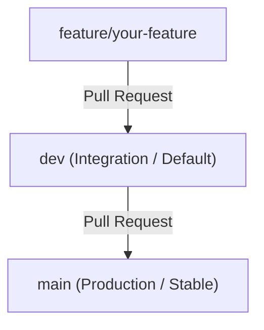

# Git Branching Strategy & Branch Protection Guide

To maintain a clean and reliable codebase, this repository follows a structured branching policy supported by automated GitHub Actions CI/CD checks.

---

## 1. Branching Strategy

Our git flow consists of the following structure:

1. **`dev` Branch (Default Branch)**
   - Serves as the primary integration branch for development.
   - All feature and bugfix branches must target `dev` via Pull Requests.
   - **Direct commits/pushes to `dev` are prohibited.**

2. **`main` Branch (Production Branch)**
   - Holds the stable, production-ready release code.
   - **Only pull requests originating from `dev` can target `main`.**
   - Merges to `main` trigger the production Docker image tagging/mirroring release.
   - **Direct commits/pushes to `main` are prohibited.**

3. **Feature & Bugfix Branches (`feature/*`, `bugfix/*`)**
   - Created from the latest `dev` branch.
   - Developers work in isolation and push to their remote feature branches.

---

## 2. How Branch Enforcement Works in CI

Our GitHub Actions workflow ([ci.yml](file:///.github/workflows/ci.yml)) automatically checks the source and target branches when a Pull Request is opened:

- If a developer opens a Pull Request targeting `main` from a branch other than `dev` (such as `feature/something`), the **`Validate PR Target Branch`** check will fail.
- Because this status check is marked as **required** in the Branch Protection settings, GitHub will block the merge button.
- The developer will be prompted to change their base branch to `dev`.

---

## 3. GitHub Branch Protection Settings (Configured)

To enforce this workflow, the following branch protection rules have been configured on GitHub settings:

### Main Branch (`main`)

- **Require a pull request before merging**: Enabled (direct pushes to `main` are blocked).
- **Require approvals**: Enabled (requires at least **1** review/approval before merging).
- **Require status checks to pass before merging**: Enabled. The following automated checks must pass successfully before merging:
  - `Validate PR Target Branch`
  - `Coding Standards`
  - `Client Lint and Build`
  - `Server Build and Prisma Validation`
  - `Validate Docker Build`
- **Block force pushes**: Enabled (prevents rewriting `main` history).
- **Do not allow bypassing the above settings**: Enabled (applies to repository owners/administrators).

### Dev Branch (`dev`)

- **Require a pull request before merging**: Enabled (direct pushes to `dev` are blocked).
- **Require status checks to pass before merging**: Enabled. The following automated checks must pass before merging:
  - `Coding Standards`
  - `Client Lint and Build`
  - `Server Build and Prisma Validation`
  - `Validate Docker Build`
- **Block force pushes**: Enabled.
